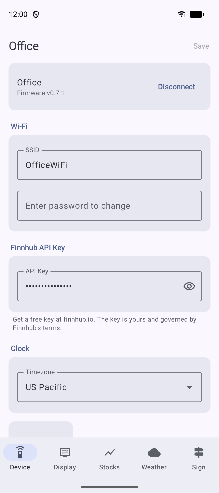
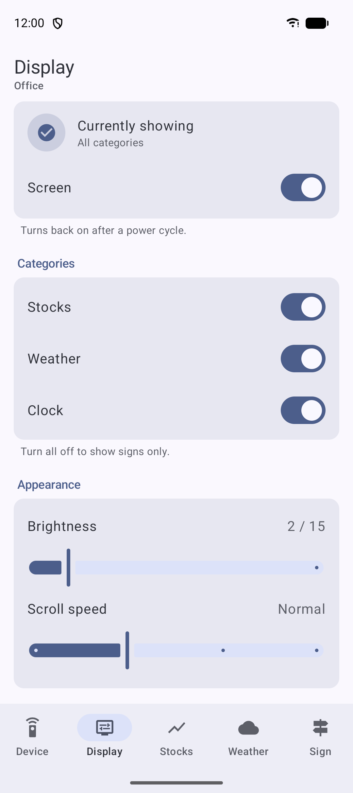
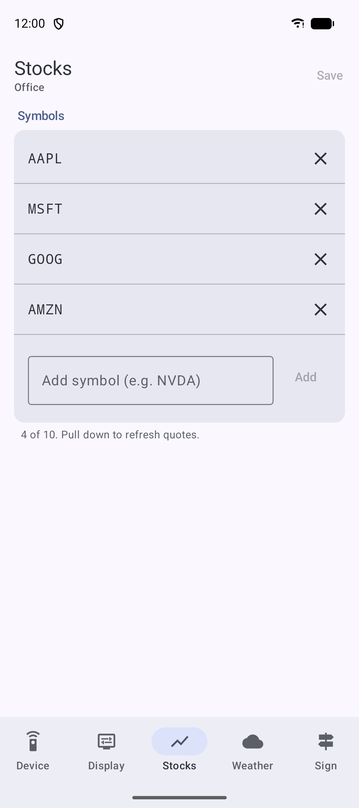
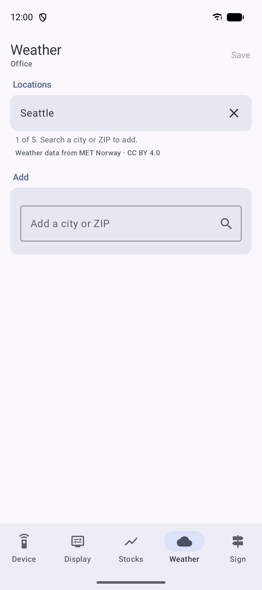
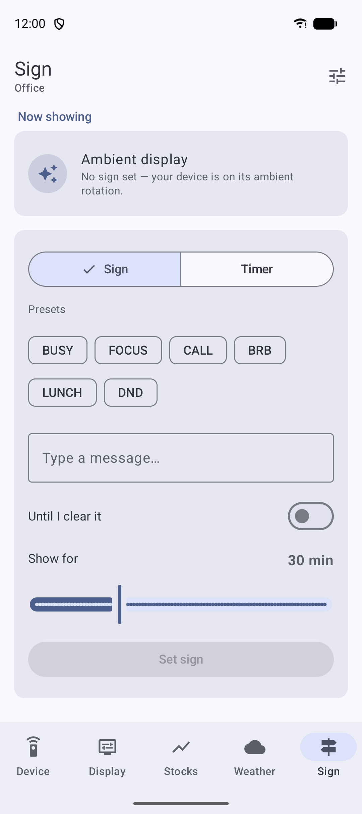

# LED Ticker Android App

Native Android (Kotlin + Jetpack Compose + Material 3) app that configures the
ESP32 LED Ticker over BLE from your Android phone or tablet. It's the Android
counterpart of the iOS app and the [Python CLI](https://github.com/ssayala/led-ticker/tree/main/tools), speaking the same BLE service.

> Part of the open-source [LED Ticker](https://github.com/ssayala/led-ticker)
> project. Clone it on its own and build — nothing here depends on the firmware
> repo. (The maintainer happens to clone it as the firmware repo's `android/`
> subfolder so the firmware, the BLE protocol doc, and the Python CLI sit
> alongside during development, but that's just convenience, not a requirement.)

Five tabs (Device, Display, Stocks, Weather, Sign), the same BLE contract, and
the same per-tab behaviour as the iOS app (dirty tracking, optimistic writes,
prereq gating, preset chips, countdown timer). The look and feel is native
Android: Material You dynamic color, a bottom navigation bar, Material 3
components, and the system pairing dialog for BLE bonding.

<p align="center">
  <picture><source media="(prefers-color-scheme: dark)" srcset="screenshots/device-dark.png"></picture>
  <picture><source media="(prefers-color-scheme: dark)" srcset="screenshots/display-dark.png"></picture>
  <picture><source media="(prefers-color-scheme: dark)" srcset="screenshots/stocks-dark.png"></picture>
  <picture><source media="(prefers-color-scheme: dark)" srcset="screenshots/weather-dark.png"></picture>
  <picture><source media="(prefers-color-scheme: dark)" srcset="screenshots/sign-dark.png"></picture>
</p>
<p align="center"><sub>Device · Display · Stocks · Weather · Sign — shown in the built-in simulated-device mode</sub></p>

The wire format is defined by the firmware's
[`BLE_PROTOCOL.md`](https://github.com/ssayala/led-ticker/blob/main/BLE_PROTOCOL.md)
— the public, app-agnostic contract both apps and the CLI implement. Keep
`model/Payloads.kt` in sync with it.

> **First connect prompts for a PIN.** The device requires BLE bonding before
> accepting writes; Android shows its native pairing dialog for the 6-digit
> PIN scrolled on the matrix in setup mode (also printed to serial at boot).
> Later connects are silent. If bonding is declined or fails, the app falls
> back to an **in-app PIN dialog** that writes the PIN to the Auth
> characteristic (the same fallback the Python CLI uses).

## Install

Download the latest signed APK — **`app-release.apk`** — from the
[**Releases page**](https://github.com/ssayala/led-ticker-android/releases/latest),
then on your Android device (12+ / API 31):

1. Open the downloaded APK (tap the download notification, or find it in Files).
2. If prompted, allow your browser / Files app to **install unknown apps**.
3. Tap **Install**.

Every release is signed with the same key, so updates install over the top
without uninstalling. There's no Google Play listing — sideload only.

## Requirements

- **Android Studio** (Ladybug or newer) with the **Android 16 / API 36** SDK
  and build-tools 36.x
- **JDK 17+** (the bundled Android Studio JBR works)
- A physical Android 12+ (API 31) device for real BLE — the emulator has no
  Bluetooth, so it runs the built-in [simulated device mode](#running-without-hardware)

## Build

```bash
./gradlew assembleDebug          # build the debug APK
./gradlew testDebugUnitTest      # run the host unit tests (Payloads parity)
./gradlew installDebug           # build + install on a connected device
```

Or just open this folder in Android Studio and Run.

The Gradle wrapper downloads its own Gradle distribution; the first build also
downloads AGP and the AndroidX libraries.

`local.properties` (with `sdk.dir=...`) is generated by Android Studio on
first open and is gitignored — set it manually if building purely from the CLI.

## Architecture

The structure mirrors the iOS app one-to-one so the two stay easy to keep in
sync:

| Concern | iOS | Android |
|---|---|---|
| Pure wire-format layer | `Payloads.swift` | `model/Payloads.kt` (+ `WeatherLocation.kt`) |
| BLE transport | `BLEManager.swift` (CoreBluetooth) | `ble/BleManager.kt` (Android `BluetoothGatt`) |
| Shared app state | `AppState` (`ObservableObject`) | `data/AppState.kt` (`ViewModel`, Compose state) |
| Location geocoding | `LocationSearch` (MapKit) | `data/LocationSearch.kt` (`Geocoder`) |
| Tabs / screens | SwiftUI tabs | Compose `ui/*Screen.kt` |

- `model/Payloads.kt` is dependency-free and unit-tested in
  `app/src/test/` — the byte-for-byte wire format must match the firmware's
  [`BLE_PROTOCOL.md`](https://github.com/ssayala/led-ticker/blob/main/BLE_PROTOCOL.md)
  and [`tools/led.py`](https://github.com/ssayala/led-ticker/tree/main/tools).
- `BleManager` is owned by the `Application` (survives config changes), runs a
  single serial GATT operation queue, and tracks bond state for the auth gate.
- BLE permissions (`BLUETOOTH_SCAN` with `neverForLocation`, `BLUETOOTH_CONNECT`)
  are requested at runtime by `MainActivity`.

## Running without hardware

The emulator (and any device without BLE) automatically runs a **simulated
device mode** (`BleManager.isEmulator()`): two fake units ("Office", "Home")
with seeded state, so the whole UI — connect flow, all five tabs, writes,
toasts — can be exercised without a physical LED Ticker. Real builds on real
phones never use this path.

## License

[Apache-2.0](LICENSE) © Sunil Sayala — same license as the LED Ticker firmware
and Python client. Free to use, build, modify, share, and sell, with attribution.

Note that the GitHub release APKs are signed with the project's private release
key (kept out of this repo). A fork that ships its own builds must generate its
own signing key — see the `release` job in
[`.github/workflows/android.yml`](.github/workflows/android.yml).
